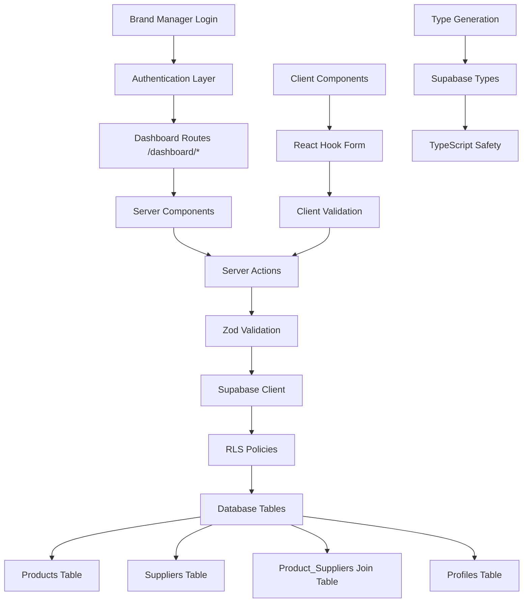
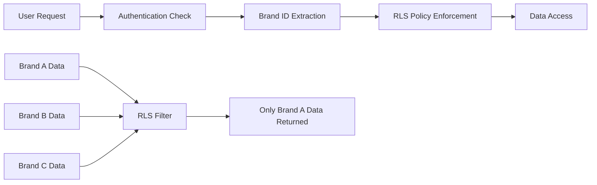

# Design Document

## Overview

The Brand Dashboard is the secure, authenticated core of the Veritas platform, enabling brand managers to create products and map their multi-tier supply chain relationships. The system leverages Next.js 15 App Router with Server Actions, Supabase with Row-Level Security (RLS), and Shadcn/ui components to deliver a secure, type-safe, and performant multi-tenant SaaS experience.

The architecture follows a security-first approach with server-side validation, client-side form management, and comprehensive data isolation between brands through database-level security policies.

## Architecture

### High-Level Architecture



### Security Architecture



### Data Flow

1. **Authentication**: User authenticates via Supabase Auth
2. **Brand Context**: System extracts brand_id from user profile
3. **Server Actions**: Form submissions trigger server-side validation and processing
4. **RLS Enforcement**: Database automatically filters data by brand_id
5. **UI Updates**: Successful operations trigger revalidation and UI refresh
6. **Type Safety**: Generated types ensure compile-time safety throughout

## Components and Interfaces

### Core Data Types

```typescript
// Generated from Supabase schema
interface Database {
  public: {
    Tables: {
      products: {
        Row: {
          id: string;
          name: string;
          brand_id: string;
          created_at: string;
          updated_at: string;
        };
        Insert: {
          name: string;
          brand_id: string;
        };
        Update: {
          name?: string;
        };
      };
      suppliers: {
        Row: {
          id: string;
          name: string;
          tier: 1 | 2 | 3;
          location: string;
          parent_supplier_id: string | null;
          brand_id: string;
          created_at: string;
        };
        Insert: {
          name: string;
          tier: number;
          location: string;
          parent_supplier_id?: string | null;
          brand_id: string;
        };
      };
      product_suppliers: {
        Row: {
          product_id: string;
          supplier_id: string;
          created_at: string;
        };
        Insert: {
          product_id: string;
          supplier_id: string;
        };
      };
    };
  };
}
```

### Validation Schemas

```typescript
// lib/schemas.ts
export const ProductSchema = z.object({
  name: z.string().min(3, "Product name must be at least 3 characters."),
});

export const SupplierSchema = z.object({
  name: z.string().min(3, "Supplier name is required."),
  tier: z.coerce.number().int().min(1).max(3),
  location: z.string().min(2, "Location is required."),
  productId: z.string().uuid("Valid product ID required."),
  parentSupplierId: z.string().uuid().optional().nullable(),
});

export type FormState = {
  errors?: { [key: string]: string[] | undefined };
  message?: string | null;
};
```

## Components and Interfaces

### 1. Server Actions Layer (`app/actions.ts`)

**Purpose**: Secure server-side data mutations with validation

**Key Functions**:

#### `createProduct(prevState: FormState, formData: FormData)`
- Validates input using ProductSchema
- Extracts brand_id from authenticated user profile
- Inserts product with automatic brand association
- Handles database errors and validation failures
- Triggers UI revalidation and navigation

#### `addSupplierToProduct(prevState: FormState, formData: FormData)`
- Validates supplier data including tier and parent relationships
- Performs atomic operations: supplier creation + product linking
- Maintains referential integrity for supply chain hierarchy
- Provides detailed error handling and success feedback

**Security Features**:
- Server-side validation prevents client-side bypasses
- Automatic brand_id injection prevents cross-tenant data access
- Transaction-like operations ensure data consistency

### 2. Dashboard Pages

#### Products List Page (`app/dashboard/products/page.tsx`)

**Purpose**: Main dashboard showing all brand products

**Architecture**:
- Next.js Server Component for optimal performance
- Direct database queries with automatic RLS filtering
- Shadcn Table component for data presentation
- Integrated dialog for product creation

**Features**:
- Server-side data fetching with no client-side loading states
- Automatic brand filtering through RLS
- Responsive table design with navigation links
- Modal-based product creation workflow

#### Product Detail Page (`app/dashboard/products/[productId]/page.tsx`)

**Purpose**: Supply chain management interface for specific products

**Architecture**:
- Dynamic route with productId parameter
- Complex data fetching with supplier hierarchy processing
- Visual tier-based layout (Tier 1, 2, 3 columns)
- Contextual supplier addition forms

**Data Processing**:
```typescript
// Supplier hierarchy processing
const suppliersByTier = {
  1: suppliers.filter(s => s.tier === 1 && !s.parent_supplier_id),
  2: suppliers.filter(s => s.tier === 2),
  3: suppliers.filter(s => s.tier === 3)
};

// Parent-child relationships
const getChildSuppliers = (parentId: string, tier: number) => 
  suppliers.filter(s => s.parent_supplier_id === parentId && s.tier === tier);
```

### 3. Form Components

#### Product Creation Form (`components/forms/CreateProductForm.tsx`)

**Purpose**: Client-side form for product creation

**Architecture**:
- React Hook Form with Zod resolver for validation
- useFormState integration for Server Action communication
- Shadcn Form components for consistent UI
- Loading states and error handling

**Features**:
- Real-time client-side validation
- Server-side error display
- Accessible form design with proper labeling
- Optimistic UI updates

#### Supplier Addition Form (`components/forms/AddSupplierForm.tsx`)

**Purpose**: Context-aware supplier creation form

**Architecture**:
- Props-based configuration (productId, tier, parentSupplierId)
- Dynamic form behavior based on tier selection
- Hidden field management for context preservation
- Success callback integration for dialog management

**Context Handling**:
```typescript
interface AddSupplierFormProps {
  productId: string;
  tier: number;
  parentSupplierId?: string | null;
  onFormSuccess: () => void;
}
```

### 4. Dialog Components

#### Create Product Dialog (`components/dialogs/CreateProductDialog.tsx`)

**Purpose**: Modal interface for product creation

**Features**:
- Shadcn Dialog component integration
- State management for open/close behavior
- Form integration with success handling
- Responsive design for mobile compatibility

#### Add Supplier Dialog (`components/dialogs/AddSupplierDialog.tsx`)

**Purpose**: Context-aware supplier addition modal

**Features**:
- Dynamic title based on tier and parent context
- Form state management and reset on close
- Success handling with automatic dialog closure
- Error state preservation across dialog interactions

## Data Models

### Database Schema

```sql
-- Products table with brand isolation
CREATE TABLE public.products (
    id UUID DEFAULT gen_random_uuid() PRIMARY KEY,
    name TEXT NOT NULL CHECK (length(name) >= 3),
    brand_id UUID NOT NULL REFERENCES public.profiles(brand_id),
    created_at TIMESTAMP WITH TIME ZONE DEFAULT NOW(),
    updated_at TIMESTAMP WITH TIME ZONE DEFAULT NOW()
);

-- Suppliers table with tier and hierarchy support
CREATE TABLE public.suppliers (
    id UUID DEFAULT gen_random_uuid() PRIMARY KEY,
    name TEXT NOT NULL CHECK (length(name) >= 3),
    tier INTEGER NOT NULL CHECK (tier IN (1, 2, 3)),
    location TEXT NOT NULL CHECK (length(location) >= 2),
    parent_supplier_id UUID REFERENCES public.suppliers(id),
    brand_id UUID NOT NULL REFERENCES public.profiles(brand_id),
    created_at TIMESTAMP WITH TIME ZONE DEFAULT NOW(),
    
    -- Ensure tier hierarchy is logical
    CONSTRAINT valid_tier_hierarchy CHECK (
        (tier = 1 AND parent_supplier_id IS NULL) OR
        (tier > 1 AND parent_supplier_id IS NOT NULL)
    )
);

-- Many-to-many relationship between products and suppliers
CREATE TABLE public.product_suppliers (
    product_id UUID NOT NULL REFERENCES public.products(id) ON DELETE CASCADE,
    supplier_id UUID NOT NULL REFERENCES public.suppliers(id) ON DELETE CASCADE,
    created_at TIMESTAMP WITH TIME ZONE DEFAULT NOW(),
    PRIMARY KEY (product_id, supplier_id)
);
```

### Row-Level Security Policies

```sql
-- Products RLS policies
ALTER TABLE public.products ENABLE ROW LEVEL SECURITY;

CREATE POLICY "Brand isolation for products" ON public.products
    FOR ALL USING (brand_id = (SELECT brand_id FROM public.profiles WHERE id = auth.uid()));

-- Suppliers RLS policies  
ALTER TABLE public.suppliers ENABLE ROW LEVEL SECURITY;

CREATE POLICY "Brand isolation for suppliers" ON public.suppliers
    FOR ALL USING (brand_id = (SELECT brand_id FROM public.profiles WHERE id = auth.uid()));

-- Product_suppliers RLS policies
ALTER TABLE public.product_suppliers ENABLE ROW LEVEL SECURITY;

CREATE POLICY "Brand isolation for product_suppliers" ON public.product_suppliers
    FOR ALL USING (
        EXISTS (
            SELECT 1 FROM public.products 
            WHERE id = product_id 
            AND brand_id = (SELECT brand_id FROM public.profiles WHERE id = auth.uid())
        )
    );

-- Public read access for DPP integration
CREATE POLICY "Allow public read access to products" ON public.products
    FOR SELECT USING (true);

CREATE POLICY "Allow public read access to suppliers" ON public.suppliers
    FOR SELECT USING (true);

CREATE POLICY "Allow public read access to product_suppliers" ON public.product_suppliers
    FOR SELECT USING (true);
```

## Error Handling

### Server Action Error Handling

```typescript
export async function createProduct(prevState: FormState, formData: FormData): Promise<FormState> {
  try {
    // Validation
    const validatedFields = ProductSchema.safeParse({
      name: formData.get('name'),
    });

    if (!validatedFields.success) {
      return {
        errors: validatedFields.error.flatten().fieldErrors,
        message: 'Validation failed. Please check your inputs.',
      };
    }

    // Database operation
    const { data, error } = await supabase
      .from('products')
      .insert({ ...validatedFields.data, brand_id })
      .select()
      .single();

    if (error) {
      console.error('Database error:', error);
      return {
        message: 'Failed to create product. Please try again.',
      };
    }

    // Success handling
    revalidatePath('/dashboard/products');
    redirect(`/dashboard/products/${data.id}`);
    
  } catch (error) {
    console.error('Unexpected error:', error);
    return {
      message: 'An unexpected error occurred. Please try again.',
    };
  }
}
```

### Client-Side Error Handling

```typescript
export function CreateProductForm() {
  const [state, formAction] = useFormState(createProduct, { message: null });
  const form = useForm<z.infer<typeof ProductSchema>>({
    resolver: zodResolver(ProductSchema),
  });

  // Display server errors
  useEffect(() => {
    if (state?.errors) {
      Object.entries(state.errors).forEach(([field, messages]) => {
        form.setError(field as keyof typeof form.formState.errors, {
          message: messages?.[0],
        });
      });
    }
  }, [state?.errors, form]);

  return (
    <Form {...form}>
      <form action={formAction}>
        {/* Form fields */}
        {state?.message && (
          <div className="text-sm text-red-500">{state.message}</div>
        )}
      </form>
    </Form>
  );
}
```

### Database Error Recovery

- **Constraint Violations**: Specific error messages for tier hierarchy violations
- **Foreign Key Errors**: Clear messaging for invalid parent supplier references  
- **Unique Constraint Errors**: Handling for duplicate product names within brands
- **Connection Errors**: Retry logic with exponential backoff

## Testing Strategy

### Unit Testing

**Server Actions Testing**:
```typescript
describe('createProduct', () => {
  it('should create product with valid data', async () => {
    const formData = new FormData();
    formData.append('name', 'Test Product');
    
    const result = await createProduct({ message: null }, formData);
    expect(result.message).toBeNull();
  });

  it('should return validation errors for invalid data', async () => {
    const formData = new FormData();
    formData.append('name', 'ab'); // Too short
    
    const result = await createProduct({ message: null }, formData);
    expect(result.errors?.name).toBeDefined();
  });
});
```

**Component Testing**:
```typescript
describe('CreateProductForm', () => {
  it('should display validation errors', async () => {
    render(<CreateProductForm />);
    
    const input = screen.getByLabelText(/product name/i);
    fireEvent.change(input, { target: { value: 'ab' } });
    fireEvent.blur(input);
    
    expect(await screen.findByText(/at least 3 characters/i)).toBeInTheDocument();
  });
});
```

### Integration Testing

**Database Integration**:
- Test RLS policy enforcement across different brand contexts
- Verify supplier hierarchy constraints
- Test cascade deletion behavior

**Form Integration**:
- End-to-end form submission workflows
- Server Action integration with form state
- Error handling across client-server boundary

### Security Testing

**RLS Policy Testing**:
```sql
-- Test brand isolation
SET ROLE authenticated;
SET request.jwt.claims TO '{"sub": "user1", "brand_id": "brand1"}';

SELECT * FROM products; -- Should only return brand1 products

SET request.jwt.claims TO '{"sub": "user2", "brand_id": "brand2"}';

SELECT * FROM products; -- Should only return brand2 products
```

**Authorization Testing**:
- Verify users cannot access other brands' data
- Test Server Action authentication requirements
- Validate form submission security

## Performance Optimizations

### Server-Side Optimizations

**Database Query Optimization**:
```typescript
// Optimized supplier hierarchy query
const { data: suppliers } = await supabase
  .from('suppliers')
  .select(`
    *,
    children:suppliers!parent_supplier_id(*)
  `)
  .eq('product_id', productId)
  .order('tier', { ascending: true });
```

**Server Action Caching**:
- Implement request deduplication for concurrent form submissions
- Cache brand_id lookups within request lifecycle
- Optimize revalidation paths to minimize unnecessary re-renders

### Client-Side Optimizations

**Form Performance**:
- Debounced validation for real-time feedback
- Optimistic UI updates for better perceived performance
- Lazy loading of complex form components

**Bundle Optimization**:
- Code splitting for dashboard routes
- Dynamic imports for dialog components
- Tree shaking of unused Shadcn components

### Database Performance

**Indexing Strategy**:
```sql
-- Optimize brand-based queries
CREATE INDEX idx_products_brand_id ON public.products(brand_id);
CREATE INDEX idx_suppliers_brand_id ON public.suppliers(brand_id);
CREATE INDEX idx_suppliers_parent_id ON public.suppliers(parent_supplier_id);

-- Optimize join table queries
CREATE INDEX idx_product_suppliers_product_id ON public.product_suppliers(product_id);
CREATE INDEX idx_product_suppliers_supplier_id ON public.product_suppliers(supplier_id);
```

**Connection Pooling**:
- Supabase connection pooling configuration
- Server Action connection reuse
- Connection timeout optimization

## Security Considerations

### Authentication & Authorization

**Session Management**:
- Supabase Auth integration with Next.js middleware
- Automatic session refresh handling
- Secure cookie configuration

**Brand Context Security**:
- Server-side brand_id validation on every request
- Prevention of brand_id manipulation in client requests
- Audit logging for cross-brand access attempts

### Data Protection

**Input Validation**:
- Server-side validation as primary defense
- Client-side validation for UX only
- SQL injection prevention through parameterized queries

**Output Sanitization**:
- XSS prevention in dynamic content rendering
- Safe HTML rendering for user-generated content
- Content Security Policy implementation

### Infrastructure Security

**Environment Variables**:
- Secure storage of Supabase credentials
- Separation of development and production configurations
- Regular credential rotation procedures

**Network Security**:
- HTTPS enforcement for all communications
- Supabase connection encryption
- Rate limiting for form submissions

This design provides a comprehensive foundation for implementing the Brand Dashboard feature while maintaining the highest standards of security, performance, and user experience in a multi-tenant SaaS environment.